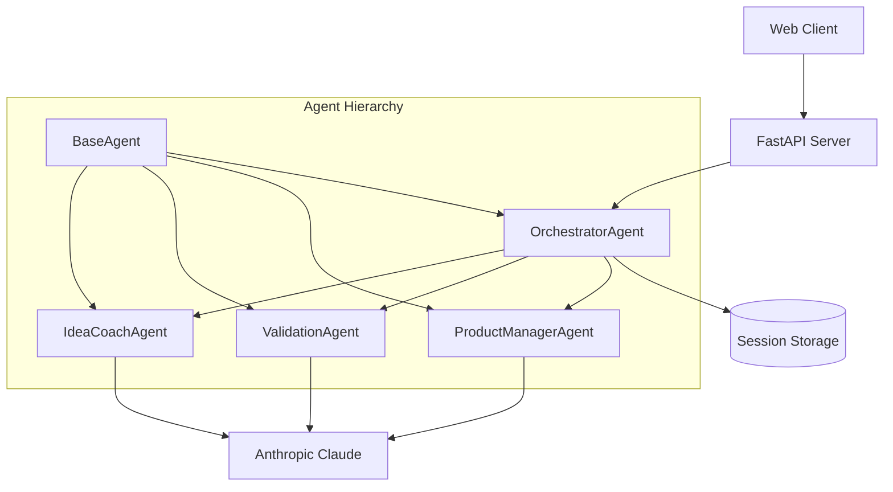

# FreshAgentLab Architecture Review
*SPARC Architect Mode Analysis*

## Executive Summary

This document presents a comprehensive architectural review of the FreshAgentLab multi-agent system, following SPARC architect methodology. The system demonstrates solid foundations with several opportunities for enhancement in scalability, resilience, and maintainability.

## Current Architecture Analysis

### 1. System Overview



### 2. Agent Communication Patterns

#### Current Data Flow
```
User Request → FastAPI → OrchestratorAgent → [IdeaCoach → Validator → ProductMgr] → Response
```

#### Strengths ✅
- **Sequential Pipeline**: Clear linear flow from ideation to validation to PRD
- **Centralized Coordination**: Orchestrator provides single point of control
- **Shared Memory**: Session-based state management enables data continuity
- **Inheritance Pattern**: BaseAgent provides consistent interface and utilities

#### Weaknesses ⚠️
- **Tight Coupling**: Agents are tightly coupled through orchestrator workflow steps
- **Single Point of Failure**: Orchestrator failure breaks entire system
- **No Parallel Processing**: Sequential execution limits throughput
- **Limited Communication**: Agents can't communicate directly with each other

### 3. Session Management and State Persistence

#### Current Implementation
```python
# In-memory session storage
self.active_sessions = {}

# Session structure
session = {
    "session_id": str,
    "created_at": datetime,
    "workflow_history": [],
    "results": {},
    "human_interactions": []
}
```

#### Strengths ✅
- **Session Isolation**: Each workflow maintains separate state
- **Rich Context**: Comprehensive session data structure
- **Workflow History**: Complete audit trail of agent interactions
- **Human-in-the-Loop**: Infrastructure for interactive decision points

#### Weaknesses ⚠️
- **Memory-Only Storage**: Sessions lost on server restart
- **No Persistence Layer**: No database or file-based storage
- **Memory Leaks**: No session cleanup or TTL mechanism
- **Scalability Limits**: In-memory storage doesn't scale across instances

### 4. Error Handling and Resilience

#### Current Implementation
```python
try:
    # Agent execution
    result = await agent.execute_task(task_data)
    self.update_metrics(True, response_time)
except Exception as e:
    self.update_metrics(False, response_time)
    return {"success": False, "error": str(e)}
```

#### Strengths ✅
- **Graceful Degradation**: Agents return structured error responses
- **Metrics Tracking**: Performance and error rates monitored
- **Status Management**: Real-time agent status updates
- **Exception Isolation**: Individual agent failures don't crash system

#### Weaknesses ⚠️
- **No Retry Logic**: Failed AI calls not retried
- **No Circuit Breaker**: No protection against cascading failures
- **Limited Recovery**: No automatic recovery mechanisms
- **Generic Error Handling**: All exceptions treated equally

### 5. Scalability Considerations

#### Current Limitations
- **Single-Instance Design**: No multi-instance coordination
- **In-Memory State**: Doesn't scale horizontally
- **Synchronous Processing**: No asynchronous agent execution
- **Resource Constraints**: No connection pooling or rate limiting

#### Performance Analysis
```
Current Throughput: 1 workflow at a time
AI API Calls: 6-8 calls per full pipeline
Processing Time: 30-60 seconds per workflow
Memory Usage: Growing with session accumulation
```

### 6. Code Organization Assessment

#### Strengths ✅
- **Clear Separation**: Each agent has focused responsibility
- **Consistent Interface**: BaseAgent provides common patterns
- **Modular Design**: Easy to add new agent types
- **Configuration-Driven**: YAML-based configuration management

#### Areas for Improvement ⚠️
- **Mixed Concerns**: Orchestrator handles both coordination and workflow logic
- **Hardcoded Workflows**: Workflow templates embedded in code
- **Limited Abstraction**: Direct AI client usage in agents
- **Missing Interfaces**: No abstract base classes for contract definition

## Architectural Recommendations

### 1. Enhanced Communication Patterns

#### Recommendation: Event-Driven Architecture
```python
# Proposed: Event-driven communication
class AgentMessageBus:
    async def publish(self, event: AgentEvent):
        # Route events to interested agents
        pass
    
    async def subscribe(self, agent_id: str, event_types: List[str]):
        # Register agent for specific events
        pass

# Enable agent-to-agent communication
class ValidationAgent(BaseAgent):
    async def on_ideas_generated(self, event: IdeasGeneratedEvent):
        # Automatically validate new ideas
        pass
```

#### Benefits:
- **Loose Coupling**: Agents communicate through events, not direct calls
- **Parallel Processing**: Multiple agents can process events simultaneously
- **Extensibility**: Easy to add new agents without modifying existing ones
- **Resilience**: Failed agents don't block other agent processing

### 2. Persistent State Management

#### Recommendation: Database-Backed Sessions
```python
# Proposed: Database session management
class SessionManager:
    def __init__(self, db_connection):
        self.db = db_connection
    
    async def create_session(self, session_data: Dict) -> str:
        # Store session in database with TTL
        pass
    
    async def get_session(self, session_id: str) -> Optional[Dict]:
        # Retrieve session from database
        pass
    
    async def update_session(self, session_id: str, updates: Dict):
        # Atomic session updates
        pass
```

#### Implementation Options:
- **Redis**: Fast in-memory database with persistence
- **PostgreSQL**: Full ACID compliance with JSON support
- **MongoDB**: Document-based storage for flexible schemas
- **SQLite**: Simple file-based option for single-instance deployments

### 3. Enhanced Error Handling

#### Recommendation: Resilience Patterns
```python
# Proposed: Circuit breaker and retry logic
class ResilientAgent(BaseAgent):
    def __init__(self, config):
        self.circuit_breaker = CircuitBreaker(failure_threshold=5)
        self.retry_policy = RetryPolicy(max_attempts=3, backoff=ExponentialBackoff())
    
    @circuit_breaker.protected
    @retry_policy.retry
    async def get_ai_response(self, prompt: str) -> str:
        # Protected AI calls with retry and circuit breaking
        pass
```

#### Resilience Improvements:
- **Circuit Breaker**: Prevent cascading failures from AI API issues
- **Retry Logic**: Automatic retry with exponential backoff
- **Fallback Mechanisms**: Graceful degradation with cached responses
- **Health Checks**: Proactive monitoring of agent and API health

### 4. Scalability Enhancements

#### Recommendation: Distributed Architecture
```python
# Proposed: Task queue and worker pattern
class AgentWorker:
    async def process_task(self, task: AgentTask):
        # Process tasks from distributed queue
        pass

class TaskQueue:
    async def enqueue(self, task: AgentTask):
        # Add task to distributed queue (Redis/RabbitMQ)
        pass
    
    async def dequeue(self, worker_id: str) -> Optional[AgentTask]:
        # Get next task for processing
        pass
```

#### Scalability Improvements:
- **Horizontal Scaling**: Multiple worker instances processing tasks
- **Load Balancing**: Distribute workload across available workers
- **Resource Pooling**: Shared AI client connections and rate limiting
- **Auto-scaling**: Dynamic worker scaling based on queue depth

### 5. Improved Code Organization

#### Recommendation: Domain-Driven Design Structure
```
agents/
├── base/
│   ├── agent.py           # Abstract base agent
│   ├── interfaces.py      # Agent contracts
│   └── messaging.py       # Communication patterns
├── domain/
│   ├── idea_generation/   # Idea generation domain
│   ├── validation/        # Validation domain
│   └── product_mgmt/      # Product management domain
├── infrastructure/
│   ├── ai_clients/        # AI service adapters
│   ├── persistence/       # Database adapters
│   └── messaging/         # Event bus implementation
└── workflows/
    ├── templates/         # Workflow definitions
    ├── orchestrator.py    # Workflow engine
    └── coordinator.py     # Agent coordination
```

## Implementation Roadmap

### Phase 1: Foundation (2-3 weeks)
1. **Database Integration**: Implement persistent session storage
2. **Error Handling**: Add retry logic and circuit breakers
3. **Health Monitoring**: Implement agent health checks
4. **Configuration**: Extract workflow templates to external files

### Phase 2: Scalability (3-4 weeks)
1. **Task Queue**: Implement distributed task processing
2. **Event Bus**: Add event-driven communication
3. **Connection Pooling**: Optimize AI client resource usage
4. **Load Balancing**: Enable multi-instance deployments

### Phase 3: Advanced Features (2-3 weeks)
1. **Parallel Processing**: Concurrent agent execution
2. **Dynamic Workflows**: Runtime workflow configuration
3. **Caching Layer**: Intelligent response caching
4. **Monitoring Dashboard**: Real-time system observability

## Risk Assessment

### High-Risk Areas
1. **Session Storage Migration**: Risk of data loss during transition
2. **API Rate Limits**: Increased load may hit provider limits
3. **Backward Compatibility**: Changes may break existing integrations
4. **Performance Regression**: New patterns may introduce latency

### Mitigation Strategies
1. **Gradual Migration**: Phased rollout with fallback mechanisms
2. **Rate Limiting**: Implement client-side rate limiting and quotas
3. **Version Management**: Maintain API versioning and deprecation notices
4. **Performance Testing**: Comprehensive load testing before deployment

## Conclusion

The FreshAgentLab architecture demonstrates solid engineering foundations with clear separation of concerns and effective agent coordination. The recommended improvements focus on:

1. **Resilience**: Better error handling and recovery mechanisms
2. **Scalability**: Horizontal scaling and performance optimization  
3. **Maintainability**: Improved code organization and testing
4. **Observability**: Enhanced monitoring and debugging capabilities

These enhancements will transform FreshAgentLab from a proof-of-concept into a production-ready multi-agent platform capable of handling enterprise-scale workloads while maintaining the elegant simplicity of the current design.

---

*This architectural review follows SPARC methodology principles, emphasizing modular design, scalability, and maintainability. All recommendations preserve the core conversational development philosophy while enabling production deployment.*